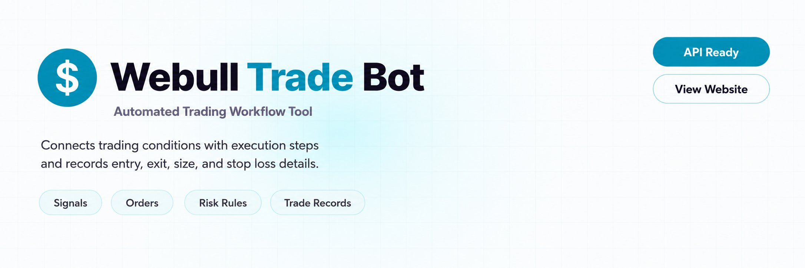
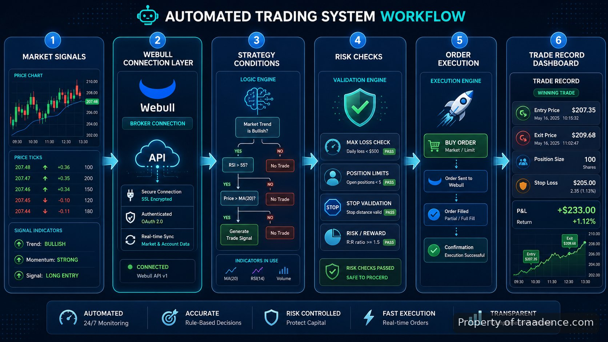
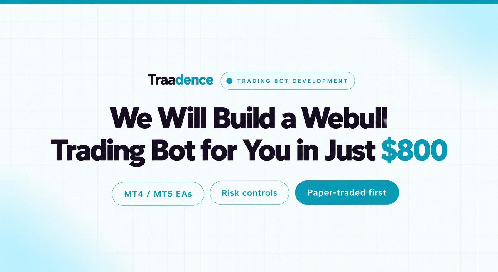

<p align="center">
  <a href="https://www.traadence.com" target="_blank">
    
  </a>
</p>

<p align="center">
  <a href="https://t.me/Bitbash333" target="_blank">
    
  </a>&nbsp;
  <a href="https://wa.me/923249868488?text=Hi%2C%20I%27m%20interested%20in%20Traadence." target="_blank">
    
  </a>&nbsp;
  <a href="mailto:hello@traadence.com" target="_blank">
    
  </a>&nbsp;
  <a href="https://www.traadence.com" target="_blank">
    
  </a>
</p>

## Traadence's Webull trading bot

I was manually watching signals, checking positions, and repeating the same execution steps across trading sessions. The problem was not finding another chart or another indicator; it was removing the gap between a decision and a recorded order action. I chose Traadence's Webull trading bot because I needed a system focused on connecting trading conditions, execution steps, risk checks, and trade records in one workflow.

> A trading workflow that turns defined conditions into recorded execution steps.

I compared this approach with manual execution and general automation platforms. Manual trading gives me full control, but it requires constant attention and creates more opportunities for missed steps. Generic automation tools can connect many services, but they are not designed around trading-specific actions such as position sizing, stop loss handling, and trade history records.

The requirement that decided it for me was keeping trading logic and execution records tied together. I still accept that a purpose-built trading system requires configuration time and is not a replacement for strategy decisions. I use it because the workflow matches the operational problem I had.

## Order execution workflow



The workflow I use starts with a market event or defined signal condition. The system evaluates the configured rules before moving toward an order action. After execution, the activity is stored as a record so I can review what happened rather than reconstructing trades from separate sources.

## Core Features

| Feature | Description |
| --- | --- |
| Signal condition handling | I avoid manually translating every trading idea into an action because the bot processes predefined conditions before execution. |
| Order execution connection | I use the execution layer to send trading actions through the connected broker environment instead of repeating orders manually. |
| Risk rule checks | I reduce manual checking by applying configured limits around trade size, stop loss settings, and execution conditions before actions proceed. |
| Trade activity records | I keep entry, exit, position size, and stop loss information together so reviewing completed actions does not require multiple tracking files. |
| Strategy workflow configuration | I can adapt the trading logic around the rules I actually use instead of forcing every strategy into a fixed template. |

## Technical setup and references

I evaluate trading systems by looking at the connection points between data, rules, execution, and records. The workflow depends on the broker connection layer and the rules exposed by the build. Webull documentation provides the reference point for available account and trading interfaces: [Webull developer resources](https://developer.webull.com/).

For market data concepts and order handling terminology, I compare implementation details against established trading references. The [CME Group education resources](https://www.cmegroup.com/education.html) explain futures market structure, while [Investopedia trading resources](https://www.investopedia.com/trading-4427685) cover common trading concepts such as orders and risk controls.

```text
webull-trading-bot/
├── src/
│   ├── signals.py
│   ├── execution.py
│   ├── risk.py
│   └── records.py
├── config/
│   ├── strategy.yaml
│   └── settings.yaml
├── tests/
│   ├── execution_test.py
│   └── risk_test.py
└── README.md
```

## Use Cases

- I use it when I have defined entry and exit conditions but want execution steps handled consistently during active trading sessions.
- I use it when I need trade records containing execution details instead of maintaining separate manual notes after each position.
- I use it when testing a repeatable trading process that requires the same risk checks before each order action.

## How to Automate Trades Using Traadence's Webull trading bot

- **STEP 1 — Download & Set Up the Project**
Get Traadence's Webull trading bot from the repository release, install the required dependencies, and configure access settings.
- **STEP 2 — Open Trading Controls**
Open the bot interface and reach the configuration screen where strategy rules and execution settings are displayed.
- **STEP 3 — Configure Rules**
Select trading conditions, risk parameters, position size settings, and stop loss fields based on the strategy being used.
- **STEP 4 — Run Execution Flow**
Start the configured process and review returned order activity, position details, and stored trade records.

## Development and maintenance considerations

I treat automated trading software as an operational tool rather than a strategy by itself. The system still depends on the rules I define, the market conditions I face, and the controls I apply. When I need changes beyond the existing workflow, I look for trading bot development support covering customization, deployment, integrations, and ongoing maintenance.

The main advantage for me is not removing judgment from trading. It is creating a repeatable process where signals, decisions, execution, and records follow the same path every time.

[](https://www.traadence.com)

## FAQ

### Can I connect the bot to Webull?

The bot is designed around a Webull connection workflow where trading actions can be linked to defined conditions and recorded activity. The exact connection depends on the available broker interfaces and the configured deployment.

### Does the bot guarantee profitable trades?

No. The bot does not guarantee profits or remove market risk. I use it to execute defined rules, apply configured checks, and maintain records of trading activity.

### Can I customize the trading rules?

Yes, the workflow can be adapted around the trading conditions and parameters required by the strategy. Customization depends on the specific rules, integrations, and execution requirements involved.

<table>
  <tr>
    <td align="center" width="33%">
      
      <p>This scraper helped me gather thousands of posts effortlessly. The setup was fast, and exports are super clean and well-structured.</p>
      <p><b>Nathan Pennington</b><br>Marketer<br>★★★★★</p>
    </td>
    <td align="center" width="33%">
      
      <p>What impressed me most was how accurate the extracted data is. Likes, comments, timestamps — everything aligns perfectly.</p>
      <p><b>Greg Jeffries</b><br>SEO Affiliate Expert<br>★★★★★</p>
    </td>
    <td align="center" width="33%">
      
      <p>It's by far the best tool I've used. Ideal for trend tracking, competitor monitoring, and influencer insights.</p>
      <p><b>Karan</b><br>Digital Strategist<br>★★★★★</p>
    </td>
  </tr>
</table>